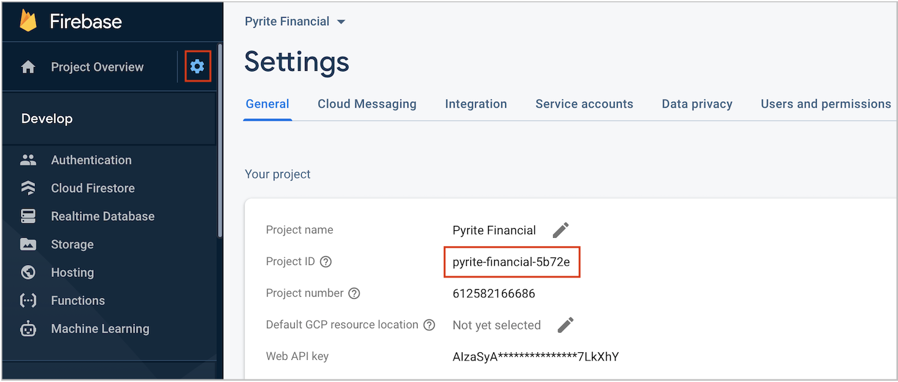
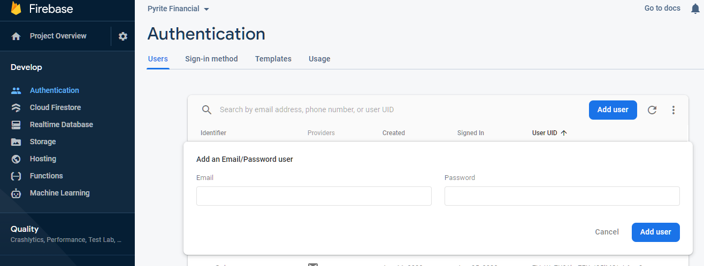
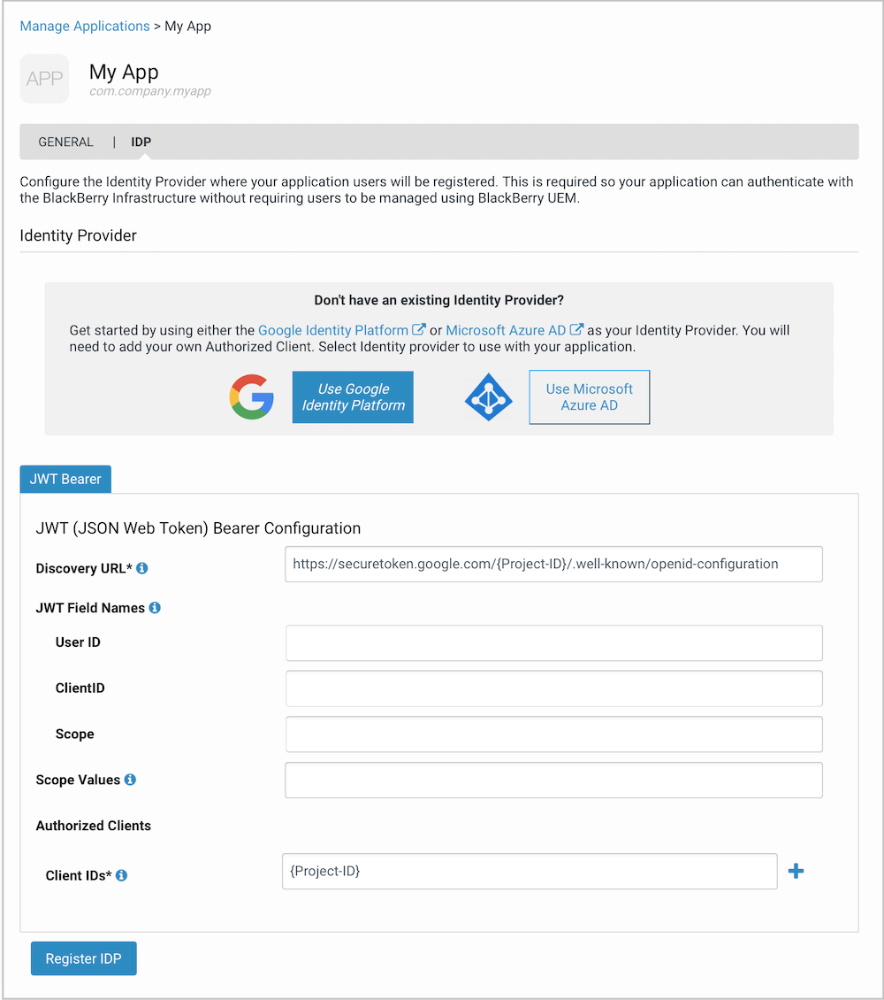

# BlackBerry Spark SDK - Sample for Android

## Overview

This Android application demonstrates how the BlackBerry Spark SDK for Android can be integrated into a fictitious consumer banking application called 'Pyrite Financial' 

#### BlackBerry Spark SDK

BlackBerry Spark is a security library for iOS and Android which provides in-app protection. It performs device, software and content checks in order to protect against security vulnerabilities and detect malicious activity. The library utilizes BlackBerry's Infrastructure to assess and respond to the latest threats. 

For additional information, see the [Developer Guide](https://docs.blackberry.com/en/development-tools/blackberry-spark-sdk/)

## Prerequisites 

- Install the following:
	- Android Studio 3.6.3 or later
	- Gradle 3.6.3 or later
- Android SDK API level 26 or above

## Getting Started

BlackBerry Spark utilizes threat models and configuration from BlackBerry Cloud and therefore it is necessary to **Register with BlackBerry** your instance of the sample before it can be run on a simulator or device. Registering and developing apps is **free**, although you do need to agree to the [Terms of Service](https://www.blackberry.com/secureappsdk).

User login is implemented using **Firebase Authentication**. This sample demonstrates how an identity token from an Open ID Connect Identity Provider (i.e. Firebase) enables the Spark  runtime to authenticate with BlackBerry's Infrastructure. 

Once you have cloned the sample from GitHub you'll need to perform the following configuration steps:-

1. Create Firebase Project
2. Register with BlackBerry
3. Add Firebase IDP configuration to BlackBerry MyAccount
4. Add the BlackBerry App Client ID to your app manifest.

### Step 1. Create Firebase Project
1. Create a Firebase project and register your Android application.
    See Steps 1 to 3: [https://firebase.google.com/docs/android/setup](https://firebase.google.com/docs/android/setup)

  - Firebase Console Step 1: Create Firebase Project

  - Firebase Console Step 2: Register iOS Application 

  - Firebase Console Step 3: Add Firebase Configuration file
    - Download the **GoogleService-Info.plist** 
    - Move your config file into the module (app-level) directory of the Pyrite Financial Android Studio project.

2. To configure the Firebase Identity Provider with BlackBerry you need to retrieve the project ID from the Firebase console. 

   a) From the 'Project Overview' select 'Project Settings'.

   b) Copy the 'Project ID'.

   

3. Enable Email/Password as a sign-in method and add a test user.

   a) Select 'Authentication' from the left hand menu in the Firebase console.

   b) On Sign-In Method tab, enable Email/Password as a sign-in method.

   c) On Users tab click 'Add User'.

   d) Enter the 'Email' and 'Password' for a test user. 
   
   

### Step 2. Register with BlackBerry

1. Goto: [https://account.blackberry.com/a/organization//applications/add](https://account.blackberry.com/a/organization//applications/add?capability=mtd)
   If you are new to BlackBerry you will need to register for a BlackBerry Online Account and agree to the Terms of Service.
2. Provide the following application information to register your instance of Pyrite Financial:
   - **Application Name:** Pyrite Financial
   - **Entitlement ID:** com.company.sample.pyritefinancial 
     - Note, you can not use 'com.blackberry.*''
   - **Management**: Uncheck 'Application will be managed by BlackBerry UEM'. This enables you to Firebase for authentication. 
   - **Capabilities:** Ensure 'BlackBerry Protect' is selected. This enables your application to utilize the BlackBerry Protect threat models.

### Step 3: Add IDP configuration to BlackBerry MyAccount

Use the Firebase Project ID from Step 1 to configure your IDP within BlackBerry myAccount.

1. Select the 'IDP' tab on the application you have just registered.



2. Enter the following 'Discovery URL' and substitute your Firebase 'Project-ID'

   `https://securetoken.google.com/{Project-ID}/.well-known/openid-configuration`

3. Add an Authorized Client ID using the Firebase Project-ID.

Once your IDP is registered a BlackBerry App Client ID will be created. 

### Step 4. Add the BlackBerry App Client ID to your app

Copy the BlacKBerry App Client ID created in the previous step and add it to the sample application's 'AndroidManifest.xml' in Android Studio.

```
<application
 		<meta-data
            android:name="com.blackberry.security.ClientID"
            android:value="abcdefgh-1234-1234-1234-abcdefgh" />
 </application>
```

### Step 5. Run the sample

You are now ready to run the 'PyriteFinancial' sample application in the emulator or on a device. 

1. Build and Run the sample from Android Studio
2. When prompted to login, use the email and password for the test user you created when setting up Firebase.
3. You may install the non malicious Test Virus from Google Play to test malware scanning. https://play.google.com/store/apps/details?id=com.androidantivirus.testvirus&hl=en_CA
4. Click on Messages, select the message and then click on the URLs in the message to test content checking.
5. Enable and disable features on your device such as Developer Mode and Screen Lock to test device security checking. Note that Sideload detection will alert you to any installed apps which are not officially signed, including app which you have installed as a developer.


### IMPORTANT!

------

To enable easily changing the URLs used in this sample to download custom scanning rules from a server of your choosing, certificate pinning has not been implemented. BlackBerry highly recommends use of certificate pinning in your production deployments, otherwise your app could be susceptible to a man in the middle attack that provides alternative rules to disable all or some features of BlackBerry Spark. Note that this is a risk posed by this sample's implementation of downloading rules and is not a vulnerability of BlackBerry Spark. Refer to the following Android documentation for instructions on how to implement certificate pinning.
https://developer.android.com/training/articles/security-config#CertificatePinning

## Getting Help

### Documentation

For detailed documentation on the BlackBerry Spark SDK for Android please see the [Developer Guide](https://docs.blackberry.com/en/development-tools/blackberry-spark-sdk/)

### Support

To get help from BlackBerry and other developers or to provide feedback please join the [BlackBerry Beta Community](https://ebeta.blackberry.com/key/join). 

## Features Implemented

| Class Name              | BlackBerry Spark SDK Features Implemented                |
| ----------------------- | ------------------------------------------------------------ |
| AccountBalanceActivity  | BlackBerry Spark SDK secure file system.                 |
| BlackBerrySecurityAgent | Initialization of BlackBerry Spark SDK.<br />Registration of broadcast receivers to receive notifications of the change of the device threat level.<br />Triggers an alert using DeviceChecksActivity to warn the user if the threat level is medium, high or critical. |
| DeviceChecksActivity    | Checks the threat status of and warns the user of threats related to: <br />**Device Security** - A range of checks are performed to determine the security health of the users device. For example, if the user has rooted the device, whether the disk is unencrypted, if the user has set a screen lock or if the device is running in developer mode.<br />**Device Software** - Checks are made against the device OS version, security patch levels and the manufacture/model of the device to confirm they meet the required security minimum standards.<br />**Malware** - Detects malicious applications or malware on an Android device using AI and machine learning to analyze the app package.<br />**Network** - Verifies that the devices is connected to a secured WiFi network. Also monitors for man in the middle attacks on networks the device is connected too (WiFi & cellular). |
| IconActivity            | BlackBerry Spark SDK secure shared preference storage.<br />Enabling of biometric authentication. |
| LoginActivity           | Authenticates the user to Firebase, which is one of many identify providers that can be used with BlackBerry Spark SDK. |
| MessageActivity         | Check if URLs, IP addresses or messages called or used within your application are safe. <br />Implement checks which help protect your app users from malicious websites, phishing attempts, malware, adware, and other web sources that pose a threat to your data. |
| PINEntryActivity        | Allows creation and entry of a PIN defined by the user,  which is then required to subsequently login to the application. Requiring an application password is an optional feature that further protects access to the runtime's Secure Storage and helps control authorized access when the device is off-line. |
| Rules                   | Demonstrates configuring rules and features.  Rules and features can be read in from or saved to JSON, which could be hosted on your server or made available via a REST call for remote configuration.  rules.json is an example of the format used in this sample. The Pyrite Financial Server sample found in this repo can be used as a host to remotely configure rules for this sample (requires adding your server URL in this class). |
| SettingsActivity        | Demonstrates uploading of BlackBerry Spark SDK logs to a BlackBerry data center for troubleshooting.<br />Displays the BlackBerry Spark SDK app instance identifier. This ID is to uniquely identify an app instance to your server.<br />Allows for manual display of DeviceChecksActivity.<br />Allows customization of the minimum Android patch level used in device software scans. This is one of many scanning rules that can be customized.<br />Shows how to enable and disable biometric authentication.<br />Shows how to enable and disable WiFi Security. |


## License

Apache 2.0 License